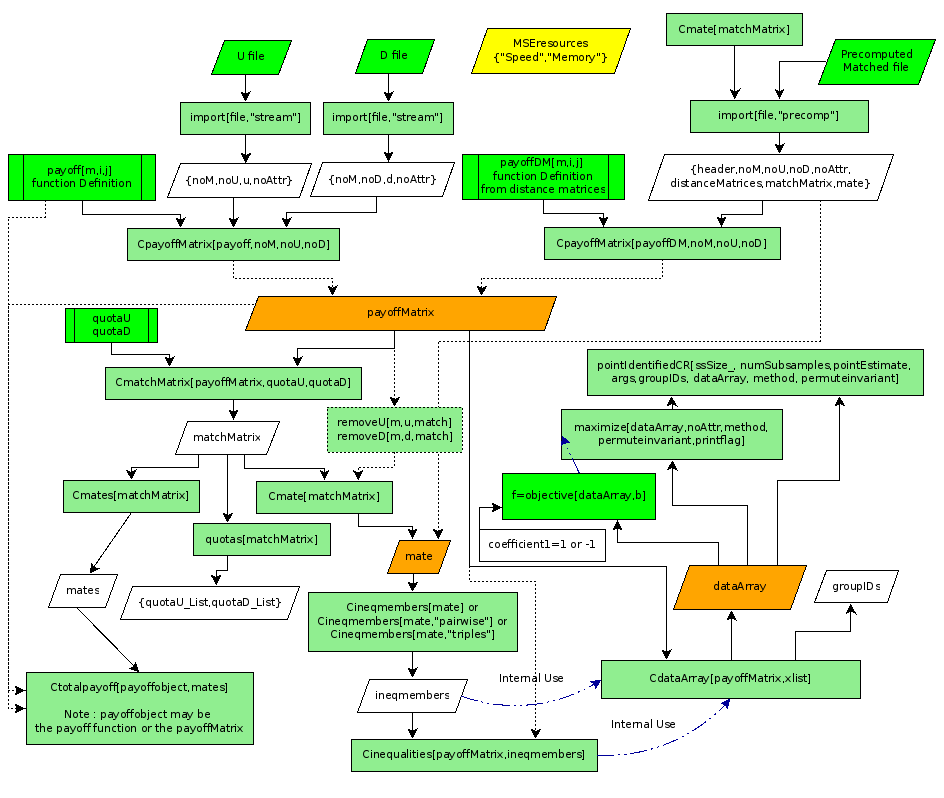

# Maximum Score Estimator

This code was designed by Theodore Chronis in collaboration with Denisa Mindruta.

The code builds upon Jeremy Fox’s theoretical work on the “pairwise maximum score estimator” (Fox 2010; Fox 2016) and the original Match Estimation toolkit (Santiago and Fox, 2009) which can be downloaded from http://fox.web.rice.edu/

To understand the present code the user needs to be familiar with the maximum score estimator and formal matching games. To ease the exposition, this documentation and the code itself follow closely the terminology used by Jeremy Fox. Unless stated otherwise, please refer back to the original sources for definitions and technical details accessible via the links at the bottom of this document.  

## Installation Instructions

1. Download the zip file (https://github.com/tchronis/MSE-Mathematica/archive/master.zip)

2. Extract the downloaded compressed file MSE-Mathematica-master.zip

3. Goto examples/ and open any of the examples to experiment with specific cases

4. Make sure you have set the correct library path at the beginning of your notebooks

## Documentation

A full description of all upgrades can be found under doc/MSE-Mathematica.docx

https://github.com/tchronis/MSE-Mathematica/blob/master/doc/MSE-Mathematica.docx

The code is broken down to several files that are all tied together through the main library file **mse.m** , which must be loaded before calling any MSE function described in doc/functions-reference.docx

https://github.com/tchronis/MSE-Mathematica/blob/master/doc/functions-reference.docx

For a more complete

## Overview of the possible paths you can choose to follow to solve a particular problem

 

## Files List

 ## Directory Structure

 | Directory     | Description   |
 | ------------- | -------------- |
 | doc/          | Documentation Files |
 | import/       | Data files used in examples |
 | examples/     | Various flows examples |
 | simulate_data/| Includes a standalone notebook based on Jeremy's original Library to create simulated data and test matching by defining the coefficients of the usual payoff function.|
 | testing/      | Testing routines |
 | .gitignore    | Exclude certain files and directories in your working directory |
 | LICENSE       | A short and simple permissive license with conditions only requiring preservation of copyright and license notices. |
 | PSO.m,nb      | Particle Swarm Optimization Method |
 | README.md     | This file |
 | SimpleJavaReloader.m | A Java library necessary for some importing routines |
 | confidence.m,nb| Calculate confidence intervals - regions |
 | dataArray.m,nb | Storing inequalities data Matrices |
 | export.m,nb | Exporting data routines |
 | import.m,nb | Importing data routines |
 | inequalities.m,nb | Define inequalities structures based on specific matching pattern |
 | install.nb | A helping script to identify the library's path |
 | matching.m,nb | Optimal Matching upstreams with downstreams for 1-1 or many to many relationships |
 | maximize.m,nb | Maximize the number of satisfied inequalities (or other function) |
 | modifydata.m,nb | Routines to manipulate markets |
 | mse.m,nb | Main Library file to load |
 | objective.m,nb | Definition of the objective function (number of satisfied inequalities) |
 | payoff.m,nb | upstream-downstream calculation of matching payoff |
 | wc.exe | word counting utility for windows users |

## References

David Santiago and Fox, Jeremy (2009). “A Toolkit for Matching Maximum Score Estimation and Point and Set Identified Subsampling Inference”. Last accessed from http://fox.web.rice.edu/computer-code/matchestimation-452-documen.pdf

Fox, J (2017) “Estimating Matching Games with Transfers,” Last accessed from http://fox.web.rice.edu/working-papers/fox-matching-maximum-score.pdf

Fox J. (2010). Identification in matching games. Quantitative Economics 1: 203–254

## The R version of this Library

https://github.com/tatlchri/MSE-R
